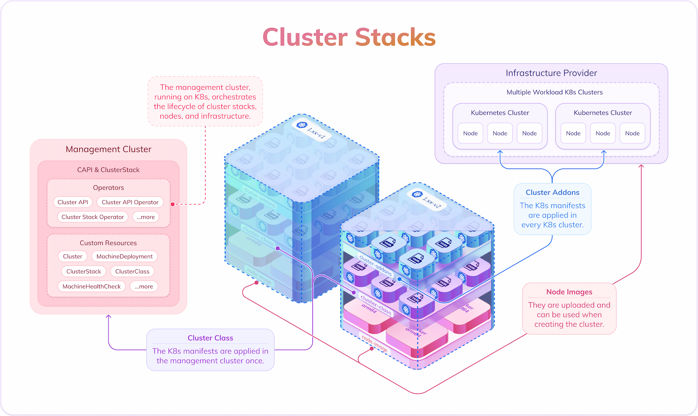

# Cluster Stacks Demo

Repository for demonstrating the capabilities and functionalities of Cluster Stacks using the cluster-stack-operator, Cluster API and the cluster-api-provider-docker.



## Overview
The Cluster Stacks Demo project aims to highlight the usage and benefits of Cluster Stacks, helping users to leverage the Cluster API for simplified Kubernetes cluster management.

## Getting Started

### Requirement

We expect you to run a Linux operating system.
You also need to install docker and golang.

### Installation

Bootstrap a cluster using kind (Kubernetes in Docker):

```
❯ make create-bootstrap-cluster

```
This will install all necessary operators into the cluster and will apply the clusterstack Custom Resource

Create a workload cluster:

```
❯ make create-workload-cluster

```
This will apply the cluster Custom Resource and will wait until the cluster is available and will install the cni.


## Known issues

### btrfs: Error response from daemon: Duplicate mount point: /dev/mapper

If using `btrfs`, you might encounter a Duplicate mount point: `/dev/mapper` error when starting `cluster-api-provider-docker`. This is a known issue, and you can track its progress and find potential solutions here: https://github.com/kubernetes-sigs/cluster-api/issues/8317
